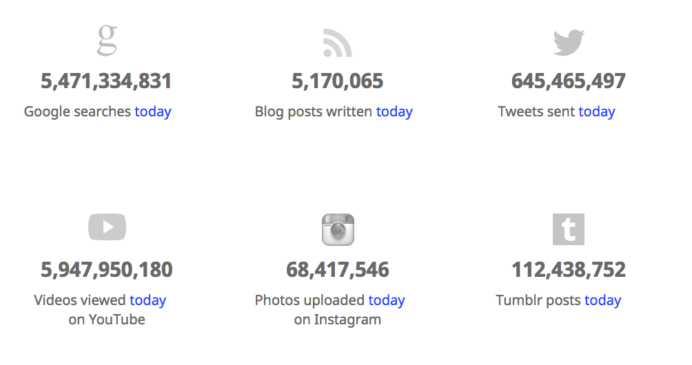

An understanding of data architecture is fundamental for data management. Data architecture looks at how data is structured and how structure maps to computing infrastructure and the data life cycle to support efficient and reliable data usage. Here we explore the skills of data husbandry and technologies of data handling through a series of lessons that look at imposing structure in unstructured data, designing data structures and publishing data for downstream use.

In this tutorial we will look at the fundamentals of data literacy and explore how low level structure in data can enable high level logic required for data science.

## Unstructured data
Unstructured data has been estimated to make up over 70% of data in organisations and constitutes multimedia files and many forms of files containin free-text, such as emails, pdfs and system logs. Unstructured data is also often available in extremely large volumes, Figure 1 shows some stats from a day of Web data, and rich in information which is only intelligible to humans and often unintelligible to a computer. An example of this is the over 68,417,546 images with no minimal annotations that are uploaded to instagram every day. This combination of high volume and low annotation makes it very difficult to extract value from the data. Our ability to navigate these data depends on structured annotations which provide a mechanism for reasoning. In this practical we're going to look at unstructured data and begin to impose structure on rich data streams that will enable us to navigate and dissect data so it can be used in analytics. We'll start by looking at image files.

---
 <br />
Figure 1. A [Live internet stats](http://www.internetlivestats.com/) snapshot from 12th September. <br />

---

# Annotating image files

Image files despite being considered as unstructured data have strict file format encoding. This encoding structure enables applications to understand the lower level binary by using the the structure to navigate chunks of data and only process the relevant parts. Abstraction is only possible if standards defined and followed. The file format encoding was defined in an open data standard, in this instance [RFC 2083](https://tools.ietf.org/html/rfc2083). RFC2083 was initially published in 1997 as an informational, a less well recognised standard, and later published as [ISO/IEC 15948](https://www.iso.org/standard/29581.html).

## Installing OpenCV

The installation process for OpenCV (if it works) is simple. Enter the command below, you should get a couple of downloads and

`pip3 install opencv-python`

Now that we have everything installed let's get started by loading an image. Copy the code below into a new file called *image-test-1.py*.

```python
import numpy as np
import cv2

# Load a image
img = cv2.imread('pic1.jpg',1)
print(img)
```

You should then move to the command-line and execute the script as below.

```
python3 image-test-1.py
```

If you have followed the instructions to the letter the result will be a glorious _None_ because *pic1.jpg* does not existing in the current directory. Move an image into the current directory, correct the filepath in the code and try again. Unsplash, [https://unsplash.com/], have a collection of great pictures that are free to use and redistribute. If you choose the following image the output is shown below. Notice the print statement provides an array of integer in the range 0-255 which is the additive primary colours that make up the raw data of the image pixels.


[[106 107 108 ...  53  58  56] <br />
 [106 107 106 ...  49  57  55] <br />
 [107 107 107 ...  49  58  57] <br />
 ... <br />
 [136 139 137 ... 116 119 120] <br />
 [138 140 138 ... 116 117 117] <br />
 [141 146 143 ... 115 115 115]] <br />

Note this pixel data is data in a form the computer can understand but if we want to present it to humans we need to run a program to convert the numeric bytes into an image. Add the following lines of code to the bottom of your script and the image should appear.

```python
# prepare GUI
cv2.namedWindow('image', cv2.WINDOW_NORMAL)
# load the image graphics
cv2.imshow('image',img)
# wait for specified milliseconds or until a key is pressed on the keyboard.
cv2.waitKey(10000)
# destroy all processes cleanly
cv2.destroyAllWindows()
```
Lets modify the image and make a simple edit. Change the '1' to a '0' so the image is loaded in black and white then write the image to disk. using the following command.

``` python
cv2.imwrite('pic1-grey.png',img)
```

Note if you go back and print the image it will display the same pixel data. However, if you look at the metadata for the file it specifies that the image is encoded with the 'color space: Gray'.  


So far we've seen the basis of file encoding and seen how metadata in the file header can affect the image. Next we're going to look at structure in files.

# Annotating unstructured data

Unstructured data is high in volume and low in value. In this section we're going to use an algorithm to identify patterns in the data and impose some structure on the data so attributes of the unstructured data can be extracted.

Given that the previous section introduced some of the object structures and design patterns that OpenCV uses in python we'll jump straight into a bigger block of code. Note that the haar cascades need to be downloaded independently.

```python
import numpy as np
import cv2

face_cascade = cv2.CascadeClassifier('haarcascade_frontalface_default.xml')
eye_cascade = cv2.CascadeClassifier('haarcascade_eye.xml')

img = cv2.imread('pic1.jpg')
gray = cv2.cvtColor(img, cv2.COLOR_BGR2GRAY)

faces = face_cascade.detectMultiScale(gray, 1.3, 5)
for (x,y,w,h) in faces:
    cv2.rectangle(img,(x,y),(x+w,y+h),(255,0,0),2)
    roi_gray = gray[y:y+h, x:x+w]
    roi_color = img[y:y+h, x:x+w]
    eyes = eye_cascade.detectMultiScale(roi_gray)
    for (ex,ey,ew,eh) in eyes:
        cv2.rectangle(roi_color,(ex,ey),(ex+ew,ey+eh),(0,255,0),2)


cv2.namedWindow('image', cv2.WINDOW_NORMAL)
cv2.imshow('image',img)
cv2.waitKey(100000)
cv2.destroyAllWindows()
```

At this stage we can see that the annotated image file is returned and some (hopefully most) of the faces are identified and highlighted with rectangles. This is useful for human interpretation but not so much for a computer. Next, we need to document the details of the image that might help us navigate the file at a later time.

At this stage we want to record the annotations identified. The snippet below simply takes the x and y coordinates, as well as the width and height of the face.

```python
f = open("face-annotation.csv", "a")
f.write("x="x)
```

This is lovely but the data and image are still separate and there is no structure to the annotation.


XMP is eXtensible Metadata Platform, which is an open standard defined by Adobe for defining metadata in multimedia files. To embed the annotation and enrich the file itself so that it can be easily indexed by its content we are going to use the _XMP Toolkit_. Additionally we will introduce _pandas_, a python libraries designed to help manipulating data structures.

Firstly we need to install the XMPtoolkit and its dependencies.

```
sudo apt-get install libexempi3  # (Ubuntu/Debian) OR brew install exempi  # (Homebrew on OS X)
pip install python-xmp-toolkit
```

Then extract and modify the XMP annotations.

```python
from libxmp.utils import file_to_dict
from libxmp import XMPFiles, consts
#simple example
xmp.set_property(consts.XMP_NS_DC, u'format', u'application/vnd.adobe.illustrator' )
print(xmp.get_property(consts.XMP_NS_DC, 'format' ))

if xmpfile.can_put_xmp(xmp) # this is incorrect syntax
xmpfile.put_xmp(xmp)
xmpfile.close_file()

#extra random snippet
xmpfile = XMPFiles( file_path="test/samples/BlueSquare.xmp" )

```

Now we have a well annotated image file. Ideal for archiving because we can find them. Look at a comparison to a log file.


# Video Processing

If we drop that into a function and replace the image with a video feed. Now we have an annotated video stream that a human could interpret.

```python

def show_webcam(mirror=False):

    face_cascade = cv2.CascadeClassifier('haarcascade_frontalface_default.xml')
    eye_cascade = cv2.CascadeClassifier('haarcascade_eye.xml')

    cam = cv2.VideoCapture(0)
#    https://www.earthcam.com/world/england/london/abbeyroad/?cam=abbeyroad_uk
    while True:
        ret_val, img = cam.read()

        gray = cv2.cvtColor(img, cv2.COLOR_BGR2GRAY)
        faces = face_cascade.detectMultiScale(gray, 1.3, 5)
        for (x,y,w,h) in faces:
            cv2.rectangle(img,(x,y),(x+w,y+h),(255,0,0),2)
            roi_gray = gray[y:y+h, x:x+w]
            roi_color = img[y:y+h, x:x+w]
            eyes = eye_cascade.detectMultiScale(roi_gray)
            for (ex,ey,ew,eh) in eyes:
                cv2.rectangle(roi_color,(ex,ey),(ex+ew,ey+eh),(0,255,0),2)

        if mirror:
            img = cv2.flip(img, 1)
        cv2.imshow('my webcam', img)
        if cv2.waitKey(1) == 27:
            break  # esc to quit
    cv2.destroyAllWindows()


def main():
    show_webcam(mirror=True)


if __name__ == '__main__':
    main()
```
In this practical we've looked at what is involved in annotating data. Archiving data is fundamental to data science and the skills described above are critical.  

We now have a stream of annotation data that contains formal structure. The file size is in the order of bytes per second rather than MB per second. Ultimately we have scratched the surface of computer vision. Next we need to share this data.


> ## Challenge task
>
> Take the data stream from a video and create a structured data store.
>
> ~~~
> code code code
> ~~~
> {: .source}
>
> > ## Solution
> >
> > This is the body of the solution.
> >
> > ~~~
> > it may also include some code
> > ~~~
> > {: .output}
> {: .solution}
{: .challenge}


https://python-xmp-toolkit.readthedocs.io/en/latest/using.html
https://www.insecam.org/en/byrating/?page=2
